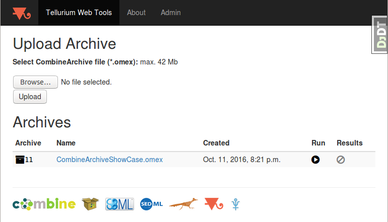

<h1>&nbsp;&nbsp;Tellurium Web Tools</h1>

[](https://travis-ci.org/matthiaskoenig/tellurium-web)
[](http://opensource.org/licenses/LGPL-3.0)
[](https://coveralls.io/github/matthiaskoenig/tellurium-web?branch=master)

Online tools for running [CombineArchives](http://co.mbine.org/documents/archive) (*.omex) with [tellurium](http://tellurium.analogmachine.org/).   
Model descriptions in 
[SBML](http://sbml.org) and simulation descriptions in [SED-ML](http://sed-ml.org) are supported.

As example archive the [Combine Showcase Archive](https://github.com/SemsProject/CombineArchiveShowCase) is provided.



Screenshot of the CombineArchive upload and list of Archives.

## License
* Source Code: [LGPLv3](http://opensource.org/licenses/LGPL-3.0)
* Documentation: [CC BY-SA 4.0](http://creativecommons.org/licenses/by-sa/4.0/)

## Installation
### Requirements
`tellurium-web` requires `python 3.5` or `python 3.6`.

### Setup
```
mkvirtualenv tellurium-web
(tellurium-web) pip install -r requirements.txt
```

In addition tellurium must be installed in the environment. This can be done
by cloning the `tellurium repository` and installing the latest version via
```

```

The test server can be run via
```
cd teweb
python manage.py makemigrations
python manage.py makemigrations combine
python manage.py migrate
python manage.py runserver
python manage.py createsuperuser
```
Database can be filled via
```
./scripts/fill_db.sh
```

## Changelog
*v0.1* [?]
- initial release


# Technology
This section gives an overview over the employed technology in `tellurium-web`

### Web framework 
* [django](https://www.djangoproject.com/)

### Database layer
* [sqlite](https://www.sqlite.org/) (develop) & [postgres](https://www.postgresql.org/) (deploy)

### Task queue
* [celery](http://www.celeryproject.org/) Distributed task queue
* [jobtastic](https://github.com/PolicyStat/jobtastic)
* [rabbitmq](https://www.rabbitmq.com/) Message broker

### Interactive plots
python plot framework (interactive)
* [plotly](https://plot.ly/python/) with examples https://plot.ly/python/line-charts/
* [bokeh](https://bokeh.pydata.org/en/latest/) 
* [plotly.js](https://github.com/plotly/plotly.js) 

### Docker 
* development & deployment in container
* reproducible environments for testing
