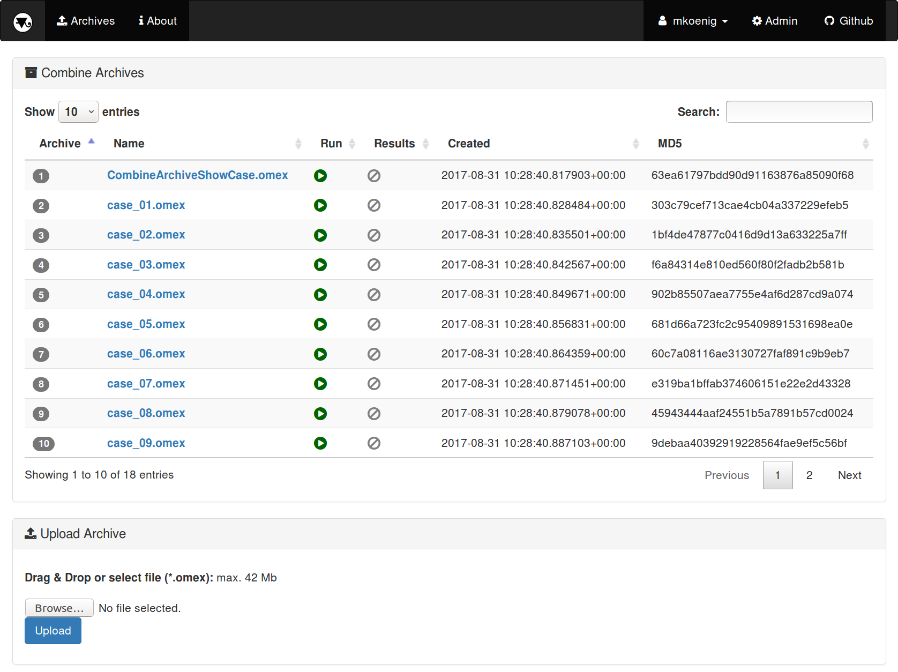

<h1>&nbsp;&nbsp;Tellurium Web Tools</h1>

[](https://travis-ci.org/matthiaskoenig/tellurium-web)
[](http://opensource.org/licenses/LGPL-3.0)
[](https://coveralls.io/github/matthiaskoenig/tellurium-web?branch=master)

Web based database and tools for running simulation experiments in computational biology 
based on [COMBINE Archives](http://co.mbine.org/documents/archive) (*.omex) 
using [tellurium](http://tellurium.analogmachine.org/) as simulation backend. 

A [COMBINE Archive](http://co.mbine.org/documents/archive) is a single zip file containing the various documents 
necessary for the description of a model and all associated data and procedures. 
This includes for instance, but not limited to, simulation experiment descriptions, 
all models needed to run the simulations and associated data files. 
The archive is encoded using the Open Modeling EXchange format (OMEX).

[tellurium](http://tellurium.analogmachine.org/) is a python environment for reproducible dynamical modeling 
of biological Networks. 

In the current version, model descriptions in the Systems Biology Markup Language ([SBML](http://sbml.org)), the 
de facto standard for encoding mathematical models in computational biology, and simulation descriptions in 
in the Simulation Experiment Description Markup Language ([SED-ML](http://sed-ml.org)). 


## Features
- upload and managing of COMBINE archives
- COMBINE archive viewer
- running COMBINE archive based simulation experiments
- [SBML](http://sbml.org) models (all level and versions, i.e. L2 and L3)
- [SED-ML](http://sed-ml.org) simulations (all level and versions, i.e., L1V1, L1V2 & L1V3)



Screenshot of the COMBINE archive upload functionality and the COMBINE archive browser.

`Tellurium Web` has been tested with a wide range of archives, among others 
- [COMBINE Archive Showcase](https://github.com/SemsProject/CombineArchiveShowCase)
- [JWS online](https://jjj.bio.vu.nl/) archives

## Technology
The following technology is used in `Tellurium Web`
* Web framework: [django](https://www.djangoproject.com/)
* Database layer: [sqlite](https://www.sqlite.org/) (develop) & [postgres](https://www.postgresql.org/) (deploy)
* Task queue: [celery](http://www.celeryproject.org/) Distributed task queue
* Message broker: [redis](https://redis.io/) Redis is an open source in-memory data structure store, used as a database, cache and message broker.
* Interactive plots: [plotly.js](https://github.com/plotly/plotly.js)

## License
* Source Code: [LGPLv3](http://opensource.org/licenses/LGPL-3.0)
* Documentation: [CC BY-SA 4.0](http://creativecommons.org/licenses/by-sa/4.0/)


# Installation
`tellurium-web` supports `python 3.5` or `python 3.6`.

## Basic Setup
Clone repository
```
git clone https://github.com/matthiaskoenig/tellurium-web.git
cd tellurium-web
```
Create virtual environment
```
mkvirtualenv tellurium-web --python=python3
(tellurium-web) pip install -r requirements.txt
```
Set necessary environment variables for database
```
(tellurium-web) export DJANGO_ADMIN_PASSWORD="test"
```
Set environment variable and create database
```
(tellurium-web) ./scripts/create_db.sh
```

## Task Queue
`Tellurium Web` uses a task queue to manage the execution of simulation experiments. 
To provide the functionality of simulation execution `redis` as message broker must be setup 
and a `celery` worker must be started

To install redis on Ubuntu use the installation script
```
./scripts/install_redis.sh 2>&1 | tee ./scripts/install_redis.log
```

To start a `celery` test worker change in the `teweb` folder start a worker via
```
(tellurium-web) cd teweb
(tellurium-web) celery -A teweb worker -l info
```

# Run
The test server is run via
```
(tellurium-web) cd teweb
(tellurium-web) python manage.py runserver 8001
```

## Changelog
*v0.1.0* [2017-10-19]
- initial release
- core functionality implemented


&copy; 2017 Matthias König
