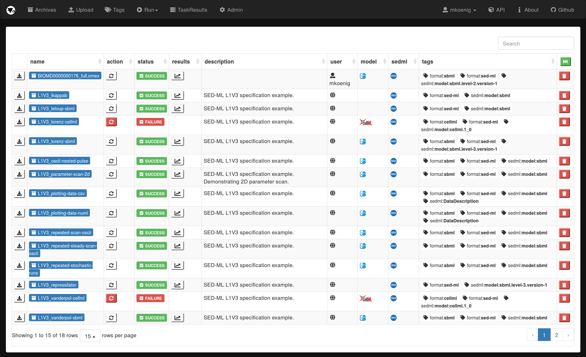

<h1>&nbsp;&nbsp;Tellurium Web</h1>

[](https://zenodo.org/badge/latestdoi/70522136)
[](https://badge.fury.io/gh/matthiaskoenig%2Ftellurium-web)
[](https://travis-ci.org/matthiaskoenig/tellurium-web)
[](http://opensource.org/licenses/LGPL-3.0)
[](https://coveralls.io/github/matthiaskoenig/tellurium-web?branch=master)

<b><a href="https://orcid.org/0000-0002-4588-4925" title="0000-0002-4588-4925"></a> Janek Grzegorzewski</b>
and 
<b><a href="https://orcid.org/0000-0003-1725-179X" title="0000-0003-1725-179X"></a> Matthias König</b>
 
`Tellurium Web` provides an online database and simulation tools for running reproducible simulation experiments in computational biology. 
 
The `Tellurium Web` workflow is based around [COMBINE Archives](http://co.mbine.org/documents/archive) (`*.omex`)
as an exchange format. [Tellurium](http://tellurium.analogmachine.org/), a python environment for reproducible dynamical modeling 
of biological networks, is used as simulation backend with [libroadrunner](http://libroadrunner.org/) as high performance simulation engine. 

A [COMBINE Archive](http://co.mbine.org/documents/archive) is a single zip file containing the various documents 
necessary for the description of a model and all associated data and procedures. 
This includes for instance, but not limited to, simulation experiment descriptions, 
all models needed to run the simulations and associated data files. 
The archive is encoded using the Open Modeling EXchange format (OMEX).

The current version of `Tellurium Web` supports model descriptions in the Systems Biology Markup Language ([SBML](http://sbml.org)), 
the de facto standard for encoding mathematical models in computational biology, and simulation descriptions in 
the Simulation Experiment Description Markup Language ([SED-ML](http://sed-ml.org)), the standard for describing
simulation experiments. 

## Features
- COMBINE archive database (upload & managing of archives)
- COMBINE archive viewer
- COMBINE archive based simulation experiments
- supports [SBML](http://sbml.org) models (all level and versions, i.e. `L2V*` and `L3V*`)
- supports [SED-ML](http://sed-ml.org) simulations (all level and versions, i.e., `L1V1`, `L1V2` & `L1V3`)

`Tellurium Web` has been tested with a wide range of archives, among others 
- [COMBINE Archive Showcase](https://github.com/SemsProject/CombineArchiveShowCase)
- [JWS online](https://jjj.bio.vu.nl/) archives

`Tellurium Web` is based existing technology and standards in the "Coordinating standards for modeling in biology" ([COMBINE](http://co.mbine.org/))  
initative, e.g., 
* [SBML](http://sbml.org) for computational models
* [SED-ML](http://sed-ml.org) for simulation experiments
* [COMBINE Archives](http://co.mbine.org/documents/archive) for the exchange of data

<a href="http://co.mbine.org/" alt="COMBINE" target="_blank"></a> &nbsp;&nbsp;
<a href="http://co.mbine.org/documents/archive" alt="COMBINE archive format" target="_blank"></a> &nbsp;&nbsp;
<a href="http://sbml.org" alt="SBML" target="_blank"></a> &nbsp;&nbsp;
<a href="http://sed-ml.org" alt="SED-ML" target="_blank"></a> &nbsp;&nbsp;
<a href="http://libroadrunner.org/" alt="libroadrunner" target="_blank"></a> &nbsp;&nbsp;
<a href="http://tellurium.analogmachine.org/" alt="Tellurium" target="_blank"></a> &nbsp;&nbsp;
<a href="http://antimony.sourceforge.net//" alt="Antimony" target="_blank"></a> &nbsp;&nbsp;

## Screenshots
Screenshot of COMBINE archive browser:


Screenshot of COMBINE archive viewer:


Screenshot of simulation results:


## Technology
The following technology is used in `Tellurium Web`
* Web framework: [django](https://www.djangoproject.com/)
* Database layer: [sqlite](https://www.sqlite.org/) (develop) & [postgres](https://www.postgresql.org/) (deploy)
* Task queue: [celery](http://www.celeryproject.org/) Distributed task queue
* Message broker: [redis](https://redis.io/) Redis is an open source in-memory data structure store, used as a database, cache and message broker.
* Interactive plots: [plotly.js](https://github.com/plotly/plotly.js)
* Websockets: Django channels

## License
* Source Code: [LGPLv3](http://opensource.org/licenses/LGPL-3.0)
* Documentation: [CC BY-SA 4.0](http://creativecommons.org/licenses/by-sa/4.0/)

## Funding
Matthias König is supported by the Federal Ministry of Education and Research (BMBF, Germany) 
within the research network Systems Medicine of the Liver (LiSyM, grant number 031L0054).
<a href="http://www.lisym.org/" alt="LiSyM" target="_blank"></a> &nbsp;&nbsp;
<a href="http://www.bmbf.de/" alt="BMBF" target="_blank"></a> &nbsp;&nbsp;

# Installation
`tellurium-web` supports `python 3.5` or `python 3.6`.

## Basic setup
Clone repository
```
git clone https://github.com/matthiaskoenig/tellurium-web.git
cd tellurium-web
```
Create virtual environment
```
mkvirtualenv tellurium-web --python=python3
(tellurium-web) pip install -r requirements.txt
```
Set necessary environment variables for database
```
(tellurium-web) export DJANGO_ADMIN_PASSWORD="test"
```
Set environment variable and create database
```
(tellurium-web) ./scripts/create_db.sh
```

## Task queue
`Tellurium Web` uses a task queue to manage the execution of simulation experiments. 
To provide the functionality of simulation execution `redis` as message broker must be setup 
and a `celery` worker must be started

To install redis on Ubuntu use the installation script
```
./scripts/install_redis.sh 2>&1 | tee ./scripts/install_redis.log
```

To start a `celery` test worker change in the `teweb` folder start a worker via
```
(tellurium-web) cd teweb
(tellurium-web) celery -A teweb worker -l info
```

# Run the test server
The test server is run via
```
(tellurium-web) cd teweb
(tellurium-web) python manage.py runserver 8001
```

# Changelog
*v0.2.0* [2018-01-06]
- complete rewrite of the user interface and core functionality
- combine archive viewer/editor (metadata)
- manifest.xml and metadata.rdf handling
- dynamic generation of archives
- archive upload via url
- user management (global and user archives)
- annotation support (external annotation files and SBML annotations)
- django channels for task notifications
- REST API (with swagger documentation)

*v0.1.0* [2017-10-19]
- initial release
- core functionality implemented


&copy; 2017 Matthias König
